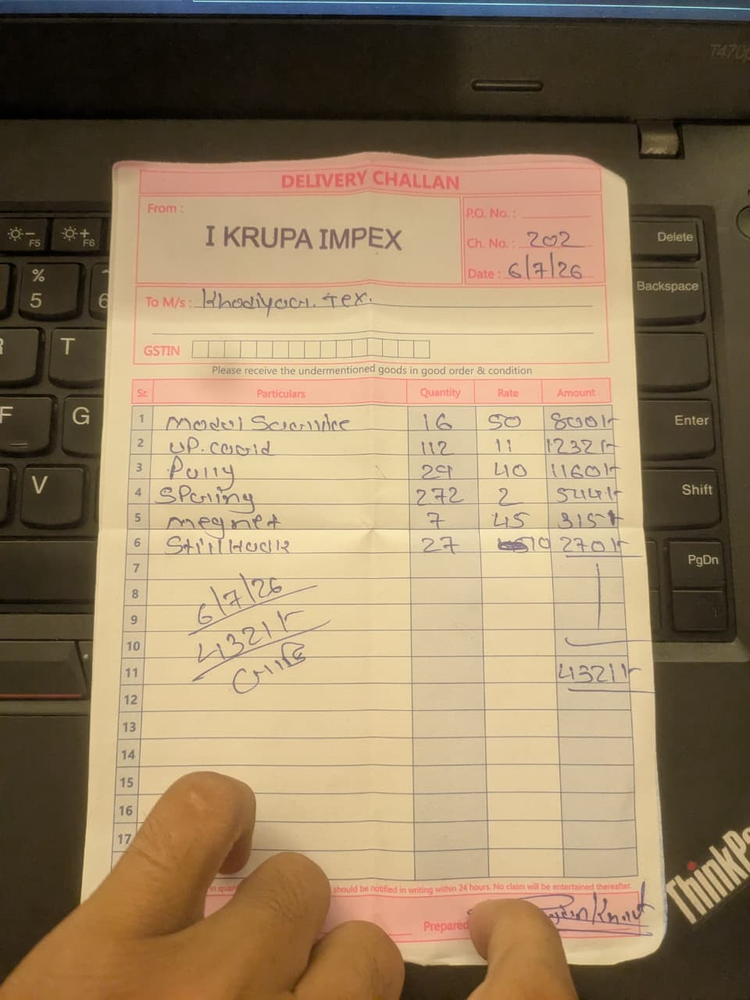

## Problem

invoice software
Repair Job Management System

bro look i'm telling you what i need

so my business is repairing the jacquard machine

so any company approach me who's jacquard machine is broken

so they contact me

then i get their machine

then i see their machine then

i know what part or component i should change

then i buy that component or and put that on the jacquard machine

and while filling the bill

i use paper like this, so i want software for this

so software should be like form 

where i can put From and To

also the date should be automatically fetched

and on the tablet it should be 

Part name, Quantity, Rate, and Total amount

GSTnumber should be in optional

and i also want all the record should be stored in database so in the future if i want to check the details of the perticualar date then i should show the details that is done on that date

also i want the overall Amount of per week and per month

also tell me what i can add 

also tell me what type of software will be best for this

web or mobile app or what ?

also tell me what tech stack will be best ?

and this should be printable
their should be one button, for sharing
if the tap that button it should open the sharing option of os
then i can send that into the Customer

also i want suggestion when i type the name of the parts
tell me should i store all the name of the parts of i should get from any api?

so i should store the part name in the database so when i try to add that machine then i should fetch name from the datebase

## Stack

PostgreSQL

which version of picocss i should use class less or with class

date picker theme change in browser

 

  <label htmlFor="gst">GST</label>
  <input
    type="text"
    id="gst"
    name="gst"
    placeholder="Optional"
  />

diff between htmlFor, label, fieldset
